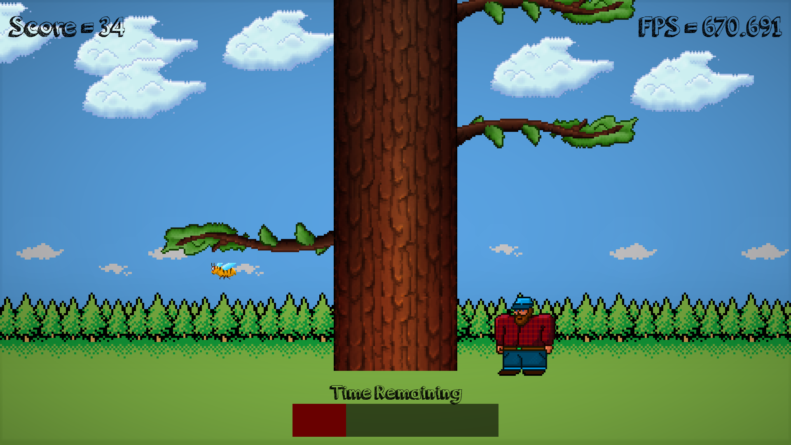

# Timber-Game

This project is made using OpenGL/SFML (Simple and Fast Multimedia Library) to cut as many logs off an infinite length tree with a limited time period.

This is an individual project. Not an original idea (learned from the C++ game programming 1 course on Linkedin Learning)

Instructions to play: 

  1.) Tree Cutting – Left and Right Key
  
  2.) Exit - Esc

